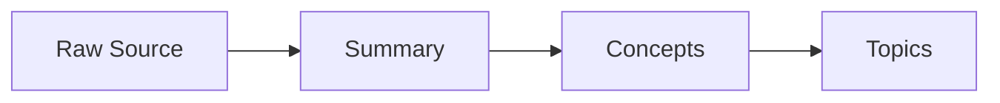
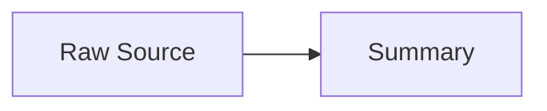

# Wiki Conventions

Rules governing wiki file formats, naming, structure, and cross-referencing. These conventions apply to all LLM-generated wiki content.

## File Naming Conventions

All wiki filenames MUST be lowercase hyphen-separated slugs matching the pattern:

```
[a-z0-9]+(-[a-z0-9]+)*.md
```

Examples: `transformer-architecture.md`, `self-attention.md`, `scaling-laws.md`

Output files follow date-stamped patterns:
- Reports: `report-<slug>-YYYY-MM-DD.md` in `outputs/reports/`
- Notes: `note-<slug>-YYYY-MM-DD.md` in `outputs/notes/`

## YAML Frontmatter Schema

Every wiki markdown file MUST begin with a YAML frontmatter block containing all 7 required fields:

```yaml
---
title: "Human-readable title"
domain: "domain-slug"
tags: [tag1, tag2, tag3]
created: "YYYY-MM-DD"
updated: "YYYY-MM-DD"
source: "raw/path/to/source.md"
confidence: high
---
```

### Required Fields

| Field | Type | Description |
|-------|------|-------------|
| `title` | string | Human-readable page title |
| `domain` | string | Owning domain slug (e.g. `machine-learning`) |
| `tags` | list | Keyword tags for categorization |
| `created` | string | ISO date when the file was first created |
| `updated` | string | ISO date of the most recent modification |
| `source` | string | Path to the raw source, or `"web search YYYY-MM-DD"` for web-imputed content |
| `confidence` | enum | One of: `high`, `medium`, `low` |

### Confidence Levels

- **high** — content derives directly from a raw source document in `raw/`
- **medium** — content derives from a single secondary source (not a primary raw source)
- **low** — content is web-imputed, skeleton placeholder, or otherwise unverified

## Backlink Syntax

All internal cross-references between wiki pages MUST use Obsidian-compatible double-bracket backlink syntax:

```
[[concept-name]]
```

- Use the filename slug without the `.md` extension
- Every new wiki file MUST link to at least 1 existing wiki file
- Every concept file MUST be reachable from `wiki/index.md` in at most 2 hops

## Tag Registry (`wiki/tags.yml`)

A canonical tag registry lives at `wiki/tags.yml`. It is the single source of truth for all tags used in wiki frontmatter.

- Every tag in a `tags:` frontmatter field MUST exist as a canonical entry in `wiki/tags.yml`.
- Common abbreviations and synonyms are listed as `aliases:` under their canonical tag (e.g. `rl` is an alias of `reinforcement-learning`).
- When writing new wiki files, always check the registry and use the canonical form.
- If a genuinely new tag is needed, add it to the registry first, then use it.
- Lint check #9 will flag alias violations (auto-fixable) and unregistered tags.

## Image Embedding

Wiki pages may embed images from the `asset/` folder when the source material contains meaningful visual content. Images are referenced using Obsidian-compatible wikilink syntax:

```
![[asset/filename.png]]
```

### Embedding Rules

- Only embed images that are **informative** — diagrams, charts, architecture figures, data visualizations, mathematical graphs. Do NOT embed decorative images, logos, avatars, or screenshots of UI that don't convey technical content.
- Every embedded image MUST have a caption on the line immediately below it, in italics:

```
![[asset/02626f722fc3af1ea3d711589d9a0150_MD5.png]]
*Figure: The three phases of ChatGPT development — pretraining, SFT, and RLHF.*
```

- Captions should be concise and describe what the image shows, not just repeat the section heading.
- Place images inline within the relevant section, close to the text that discusses them.

### Summary Files

Summary files MUST include **all informative diagrams and figures** from the source — architecture diagrams, data flow charts, comparison tables rendered as images, ablation results, mathematical visualizations, and any figure that aids comprehension of the content. The only images to exclude are purely decorative ones (photos for fun, promotional images, author avatars, product screenshots that don't convey technical content).

Since summaries are the primary record of a source document, **preserving its visual content is as important as preserving its textual content**. A summary without the source's key diagrams loses significant explanatory value, especially for engineering-heavy or architecture-focused content where the visuals carry information that prose alone cannot convey.

Embed images in the Deep Analysis section where they support the narrative. Place each image immediately after the paragraph that discusses it, with a caption that describes what the image shows and why it matters.

### Concept Files

Concept files may include up to **5 images** when the images are **closely related to the concept itself** — e.g., a diagram that defines the core idea, a comparison chart between variants, or a visualization of the concept's key mechanism. Since concept files aggregate knowledge from multiple sources, prefer images that are canonical or widely applicable rather than specific to one source's framing.

Selection priority for concept images:
1. **Defining diagrams** — images that visually define the concept (e.g., an architecture diagram for an attention mechanism)
2. **Comparison charts** — images that compare the concept against alternatives (e.g., KV cache savings across attention variants)
3. **Process/flow diagrams** — images that show how the concept works step by step

If an image is only relevant to one source's framing of the concept and doesn't generalize, it belongs in the summary, not the concept page.

### Topic Files

Topic files SHOULD proactively reuse images from their linked concept files, summary files, or raw sources to enhance readability. Topics aggregate and compare multiple concepts — visual aids are especially valuable here because they help the reader see relationships and tradeoffs that prose alone makes abstract.

Good candidates for topic images:
- **Comparative diagrams** from summaries that show how the connected concepts differ
- **Architecture overviews** from concept files that illustrate the broader theme
- **Data visualizations** (ablation results, benchmark comparisons, memory/performance charts) that support the topic's selection guidance or tradeoff analysis
- **Process diagrams** from raw sources that show how the concepts interact in practice

Do NOT duplicate every image from every linked concept — select the 3–5 most impactful images that support the topic's synthesis narrative. Every image must earn its place by adding visual information that the surrounding text references.

## Concept Files (`wiki/concepts/`)

- One atomic idea per file
- Maximum **150 lines** per concept file
- Must include a `domain:` frontmatter field identifying the owning domain MOC
- Filename is the concept slug: `<concept-slug>.md`

## Reference Files (`wiki/reference/`)

Reference files are code-heavy, syntax-oriented guides (keyword tables, API cheatsheets, configuration examples). They explain *how* with runnable examples, whereas concept files explain *what* and *why*.

- Maximum **300 lines** per reference file
- Must include valid YAML frontmatter with all 7 required fields
- Must link to at least 1 related concept file via `[[backlinks]]`
- Filename is the reference slug: `<reference-slug>.md`

### Classification Rule — Concept vs Reference

- If the content explains an **idea, principle, or architecture** → concept file (`wiki/concepts/`, 150 lines)
- If the content is a **syntax guide, keyword reference, or configuration cookbook** with substantial code examples → reference file (`wiki/reference/`, 300 lines)
- When in doubt, start as a concept. Promote to reference only when code blocks push past 150 lines and the code is essential (not decorative)

## Summary Files (`wiki/summaries/`)

Every summary file MUST contain these four sections:

1. **Executive Summary** — concise overview of the source, including the **context**: what problem or question the source is addressing, why the topic matters, and what motivated the author to write about it. The reader should understand not just *what* the source covers, but *why* it exists.
2. **Deep Analysis** — detailed breakdown of key content. For each major sub-topic or section, include the **reasoning**: why this sub-topic is discussed, how it connects to the overall argument, and what problem it solves. Don't just state facts — explain the logic that links them. When the source presents a solution or recommendation, explain the problem that prompted it.
3. **Key Insights** — the most important takeaways
4. **Related Concepts** — list of related concept links using `[[backlink]]` syntax

### Writing Guidance for Summaries

- **Context before content**: Before diving into what the source says, establish *why* it says it. What gap in understanding does it fill? What practical scenario does it address?
- **Reasoning chains over isolated facts**: When the source builds an argument across sections (e.g., "problem → naive solution → why it fails → better solution"), preserve that chain in the Deep Analysis. The reader should follow the same logical progression.
- **Transitions between sub-topics**: When moving between sections in the Deep Analysis, briefly explain *why* the next topic follows from the previous one. This prevents the summary from reading like a disconnected list of facts.
- **Preserve the "why" of recommendations**: If the source recommends approach A over approach B, explain the reasoning — what tradeoffs were considered, what failure modes are avoided. A recommendation without its rationale loses most of its value.

## Topic Files (`wiki/topics/`)

Topic files aggregate and connect multiple concepts into a broader theme. They serve as entry points for understanding a subject area that spans several atomic concepts.

### Classification Rule

- If the content describes a **single atomic idea** → create a concept file in `wiki/concepts/`
- If the content is a **syntax guide, keyword reference, or configuration cookbook** with substantial code examples → create a reference file in `wiki/reference/`
- If the content **aggregates, compares, or connects multiple concepts** → create a topic file in `wiki/topics/`
- **Never place wiki content files at the wiki root** — only `wiki/index.md` lives there

### Requirements

- Filename is the topic slug: `<topic-slug>.md`
- Must include valid YAML frontmatter with all 7 required fields
- Must link to at least 2 concept files via `[[backlinks]]`
- Should provide comparative analysis, selection guidance, or a unifying narrative across the linked concepts

### Required Structure

Every topic file MUST contain these sections:

1. **Overview** — a synthesis narrative explaining the theme, how the connected concepts relate, where they agree, and where they differ. This is NOT a list of links — it is prose that adds value beyond what the individual concept files provide.
2. **Detailed Comparison or Narrative** — deeper analysis: comparative tables, selection guides, trade-off discussions, or a unifying explanation depending on the topic type.
3. **Linked Pages** — explicit `[[backlinks]]` to all connected concept, summary, and domain files.
4. **See Also** — links to related topics or domains.

## Mermaid Diagrams

Wiki pages may use Mermaid diagrams to illustrate processes, relationships, or structures when the content benefits from visual representation. Mermaid diagrams and static images (from `asset/`) are equally valid ways to illustrate content — choose whichever fits the context best.

### When to Use Mermaid

Include a Mermaid diagram when the content describes something that is easier to understand visually than in prose — for example:

- A multi-step process or pipeline
- A request/response sequence between components
- State transitions or lifecycle stages
- Relationships or taxonomy between concepts
- An architecture with interacting parts

Do NOT add a Mermaid diagram just because a page exists. Only include one when it genuinely aids comprehension of the content.

### Diagram Type Selection

Choose the diagram type that best fits the content:

| Content Type | Recommended Mermaid Diagram |
|---|---|
| Process, pipeline, workflow | `flowchart TD` or `flowchart LR` |
| Temporal sequence, request/response | `sequenceDiagram` |
| Lifecycle, state transitions | `stateDiagram-v2` |
| Concept relationships, taxonomy | `flowchart TD` or `flowchart LR` |
| Timeline, historical progression | `timeline` |
| Class hierarchy, data model | `classDiagram` |

### Formatting Rules

- Wrap all Mermaid diagrams in a fenced code block with the `mermaid` language tag:

````

````

- Every Mermaid diagram MUST have a caption on the line immediately below the closing fence, in italics:

````

*Figure: The ingest pipeline from raw source to wiki pages.*
````

- Keep diagrams readable: prefer 5–15 nodes. If a diagram needs more, split it into multiple diagrams or simplify by grouping.
- Use descriptive node labels, not abbreviations. `[Bellman Equation]` not `[BE]`.
- Use subgraphs to group related nodes when the diagram has distinct clusters.
- Prefer `flowchart` over `graph` for new diagrams (same syntax, more features).

## Index File

- `wiki/index.md` — catalog of all wiki pages, each with a `[[link]]` and a one-line summary, organized by category (Concepts, Summaries, Topics, Reference, Domains)
- `wiki/index.md` MUST be updated after every ingest, file-back, or lint operation

## Domain Maps of Content (`wiki/domains/`)

Domain MOC files MUST contain:
- Domain overview
- List of all concept files in the domain with `[[links]]`
- List of related topic files
- Bridge notes to other domains

A domain MOC is created when 10+ concept files share the same `domain:` value.
